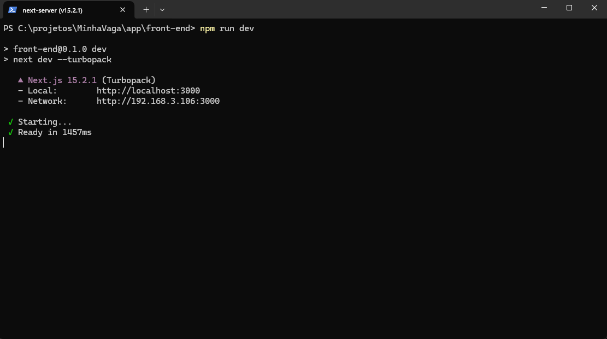
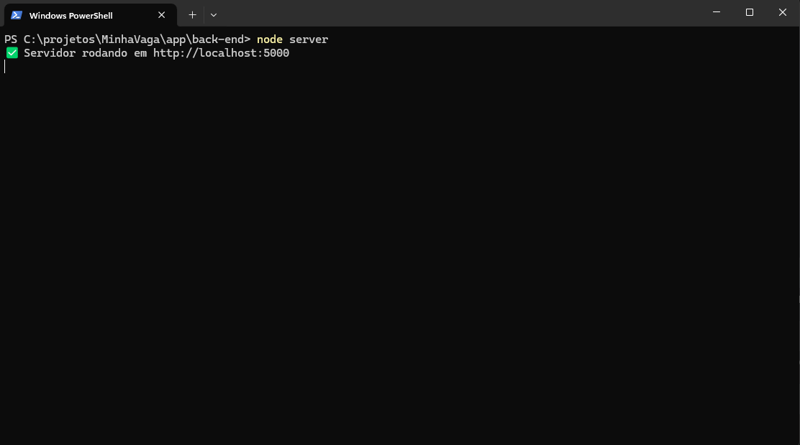
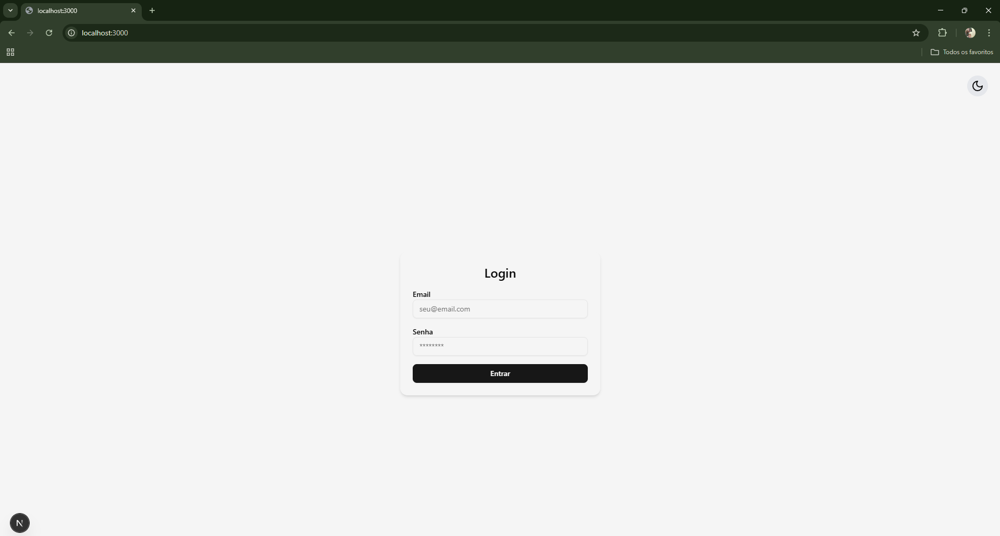
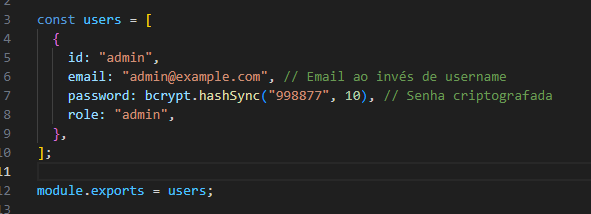
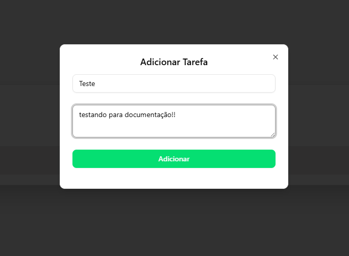
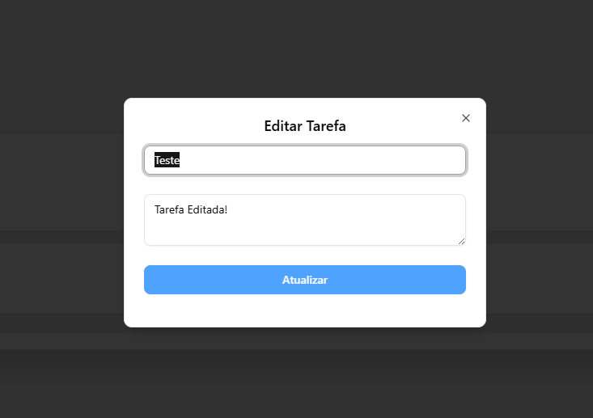
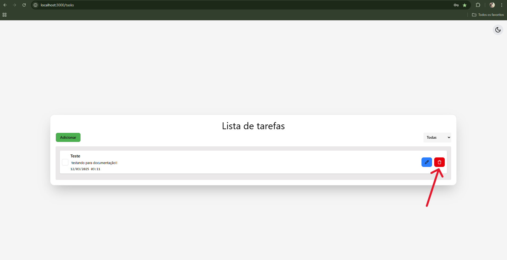
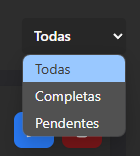
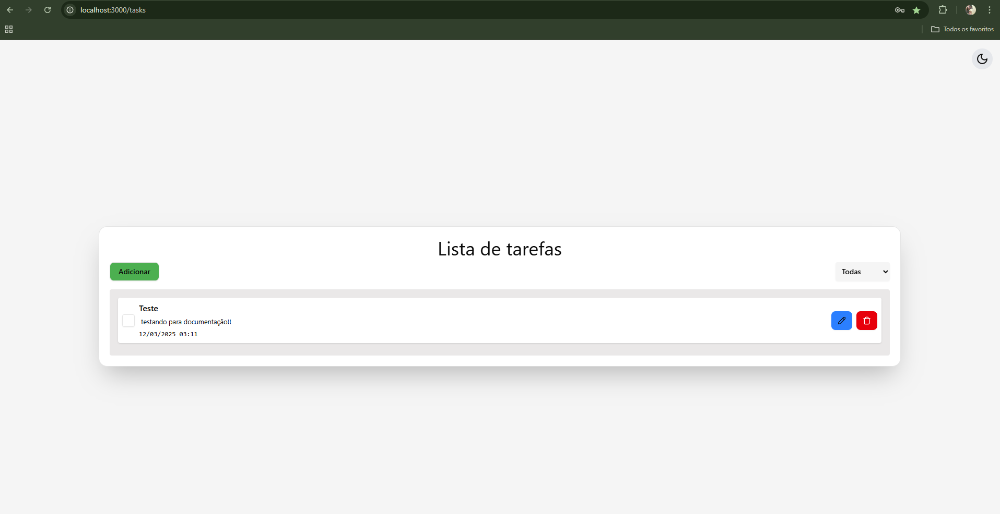
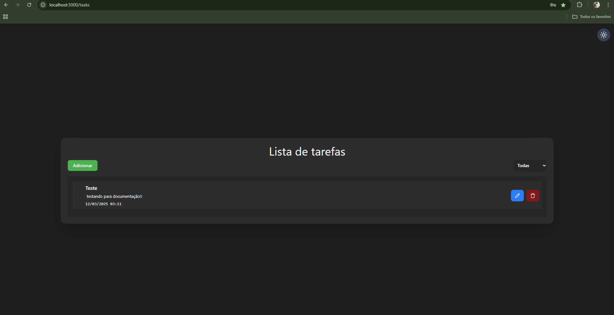

# Lista de Tarefas

Este projeto é uma aplicação de lista de tarefas desenvolvida com **Next.js**, **React**, **TypeScript**, **JWT**, **Tailwind** e **NodeJS**. A aplicação permite adicionar, editar, excluir e filtrar tarefas com diferentes status.

## Requisitos

Antes de começar, verifique se você tem os seguintes requisitos instalados:

- **Node.js** (versão 14 ou superior)
- **npm** (gerenciador de pacotes do Node.js)
- **Git** (para clonar o repositório)

## Instalação

### 1. Clonar o Repositório

Clone o repositório para sua máquina local:

```bash
git clone https://github.com/CharlesMeloBC/TodoApp.git
```
### 2. Instalar Dependências
Dentro da pasta do projeto, instale as dependências necessárias:
```cmd
cd app/front-end/
npm install

cd app/back-end/
npm install
```
### 3. Rodar o Projeto
Para iniciar o servidor de desenvolvimento do front e back, execute:

**para o front-end**⬇️
```
npm run dev
```


**para o back-end**⬇️
```
node server
```



Isso irá iniciar a aplicação no modo de desenvolvimento. Você pode acessar a aplicação no seu navegador através de http://localhost:3000. E também pode verificar o seu array de tasks na porta http://localhost:5000.

---
### Login

na rota [localhost:3000](http://localhost:3000) você encontrara uma tela de login que faz busca um token atraves da biblioteca JWT e autentica as rotas seguintes salvando o valor no localStorage



### Usuario
```
email: "admin@example.com"
password: "998877"
```


# Como Usar
### 1. Adicionar Tarefa
Clique no botão Adicionar para criar uma nova tarefa.
Insira um título e uma descrição para sua tarefa (Descrição opcional) .


Após preencher, clique em Adicionar.

### 2. Editar Tarefa
Clique no botão editar em qualquer tarefa para abrir o modal de edição.
Modifique o título e ou a descrição da tarefa conforme necessário 

clique em Atualizar para salvar as alterações.

### 3. Excluir Tarefa
Para excluir uma tarefa, clique no ícone de lixeira ao lado da tarefa que deseja remover.


### 4. Filtrar Tarefas
Você pode filtrar as tarefas de acordo com o status. As opções de filtro são Pendentes, Completas e todas.



### 5. Alterar Tema
No canto superior direito, há um switch para alternar entre o tema claro e o tema escuro.

### Escuro

### Claro



## Estrutura de Pastas 📂

```
src/
  ├── app/
  │   └── (pages)/
  │       └── tasks/
  │           ├── _components/
  │           │   ├── TaskFilter.tsx
  │           │   ├── TaskItem.tsx
  │           │   ├── TaskList.tsx
  │           │   └── TaskModal.tsx
  │           └── page.tsx
  ├── components/
  │   └── ui/
  │       └── button.tsx
  └── models/
      └── ITask.ts
```

### Componentes
* TaskFilter: Componente de filtro de tarefas (Pendentes/Concluídas).
* TaskList: Exibe a lista de tarefas filtradas.
* TaskItem: Representa uma única tarefa na lista.
* TaskModal: Modal de criação e edição de tarefas.
* ThemeToggle: Componente para alternar entre o tema claro e escuro.

### API (Backend)
O frontend se comunica com uma API para realizar operações de CRUD (Criar, Ler, Atualizar, Excluir) para as tarefas.

As funções de chamada à API são:

* getTasks: Obtém todas as tarefas.
* addTask: Adiciona uma nova tarefa.
* updateTask: Atualiza uma tarefa existente.
* deleteTask: Exclui uma tarefa.